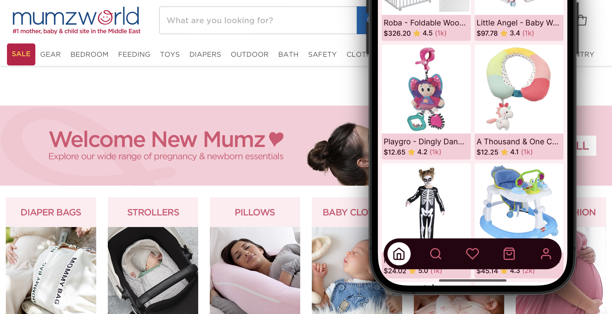

# Mumzworld 🐣

Welcome to **'Home Test'** Mumzworld App 👋

[](https://github.com/du5rte/mumzworld/actions/workflows/test.yml)



👉 Watch demo video at [vimeo.com/988209706](https://vimeo.com/988209706)

Scan the following QR code to preview this update:


Run on Expo Go with this [link](https://expo.dev/preview/update?message=feat%3A%20v1&updateRuntimeVersion=1.0.0&createdAt=2024-07-22T03%3A40%3A48.513Z&slug=exp&projectId=f643fa24-f3ea-4886-b2aa-a611921e4874&group=c60b0edf-40d4-4387-87ca-0901617f8357)

## Features

- ✅ Render **[English](locales/en.json)** 🇺🇸 and **[Arabic](locales/en.json)** 🇦🇪 with [i18next](https://www.i18next.com/)
- ✅ Toggle currencies between **USD** 🇺🇸 and **AED** 🇦🇪
- ✅ **RTL** Support (Animations also support RTL, see [BottomTabBar](components/bottom-tab-bar/bottom-tab-bar.tsx:97)
- ✅ Render 600+ products list with performance (see [ProductList](components/product-list/product-list.tsx) which uses [FlatList](https://reactnative.dev/docs/flatlist))
- ✅ Navigation and search (see [ProductScreenNavbar](components/product-screen-navbar/product-screen-navbar.tsx) and [BottomTabBar](components/bottom-tab-bar/bottom-tab-bar.tsx) )
- ✅ Image Gallery using [RNRC](https://www.npmjs.com/package/react-native-reanimated-carousel)
- ✅ Unit testing (Examples of Functional Unit Testing in [tab-bar.test.tsx](components/bottom-tab-bar/tab-bar.test.tsx) and [button.test.tsx](components/button/button.test.tsx))
- ✅ Run on Expo Go

## What's inside?

This guide explains how to this monorepo powered by:

- 📱 [Expo](https://expo.dev/) — Your go-to for crafting native apps across platforms with ease
- 🚀 [React](https://reactjs.org/) — The bread and butter for creating slick user interfaces
- 📱 [React Native](https://reactnative.dev/docs/getting-started) — Learn once, write anywhere
- 📚 [Storybook](https://storybook.js.org/) — A sandbox for UI components, making testing a breeze
- ✨ [Restyle](https://github.com/Shopify/restyle) — Theme-based components to keep your app stylish
- 🏇 [Reanimated](https://docs.swmansion.com/react-native-reanimated/) — For buttery-smooth animations
- 🧠 [Jotai](https://jotai.pmnd.rs/) — Minimalist and flexible state management, making your code cleaner and simpler
- 🔄 [SWR](https://swr.vercel.app/) — Data fetching that's not just fast, but also super smart
- 🌍 [i18next](https://www.i18next.com/) — Turning your app into a passport bro

## Development Utilities

This project comes with additional development tools:

- 📘 [TypeScript](https://www.typescriptlang.org/) for static type checking
- 📏 [ESLint](https://eslint.org/) — Keeping code in check! 👀
- ✨ [Prettier](https://prettier.io) — Keeping code looking sharp and clean
- 🧪 [Jest](https://jestjs.io/) — Testing made fun
- 🦉 [React Native Testing Library](https://callstack.github.io/react-native-testing-library/)
- 🥊 [Lefthook](https://github.com/evilmartians/lefthook) — Keeping commits in check
- 📜 [commitlint](https://commitlint.js.org/) — Ensuring commit messages meet the conventional commit format
- 🤖 [GitHub Actions](https://github.com/features/actions) — for continuous integration and deployment workflows

Pre-commit hooks verify that the linter and tests pass when committing.

## Get started

Install dependencies (using [pnpm](https://pnpm.io))

```bash
pnpm install
```

Start the app

iOS

```bash
 pnpm ios
```

Android

```bash
 pnpm ios
```

In the output, you'll find options to open the app in a

- [development build](https://docs.expo.dev/develop/development-builds/introduction/)
- [Android emulator](https://docs.expo.dev/workflow/android-studio-emulator/)
- [iOS simulator](https://docs.expo.dev/workflow/ios-simulator/)
- [Expo Go](https://expo.dev/go), a limited sandbox for trying out app development with Expo

You can start developing by editing the files inside the **app** directory. This project uses [file-based routing](https://docs.expo.dev/router/introduction).

## Learn more

To learn more about developing your project with Expo, look at the following resources:

- [Expo documentation](https://docs.expo.dev/): Learn fundamentals, or go into advanced topics with our [guides](https://docs.expo.dev/guides).
- [Learn Expo tutorial](https://docs.expo.dev/tutorial/introduction/): Follow a step-by-step tutorial where you'll create a project that runs on Android, iOS, and the web.

## Join the community

Join our community of developers creating universal apps.

- [Expo on GitHub](https://github.com/expo/expo): View our open source platform and contribute.
- [Discord community](https://chat.expo.dev): Chat with Expo users and ask questions.
